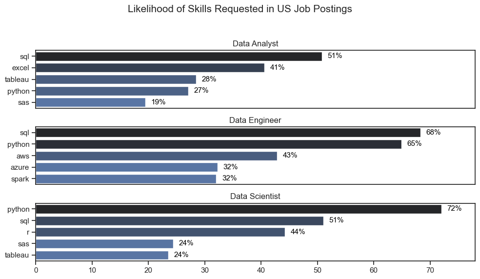
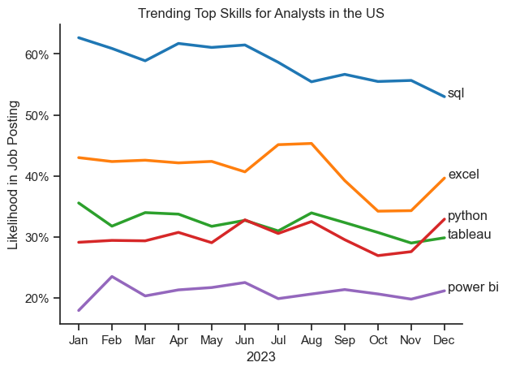

# The Analysis

## 1. What are the most demanded skills for the Top 3 most popular data roles?

To find the most demanded skills for the Top 3 most popular data roles. I filtered out those positions by which ones were the most popular, and got the top 5 skills for these top 3 roles. This query highlights the most popular job titles their top skills, showing which skills I should pay attention to depending on the role I am targeting. 

View my notebook with detailed steps here:
[2_Skill_Demand.ipynb](2_Skill_Demand.ipynb)


### Visualize Data

```python
fig, ax = plt.subplots(len(job_titles), 1,figsize=(10, 6))

sns.set_theme(style="ticks")

for i, job_title in enumerate(job_titles):
    df_plot = df_skills_perc[df_skills_perc['job_title_short'] == job_title].head(5)
    sns.barplot(data=df_plot, x='skill_percent', y='job_skills', ax=ax[i], palette='dark:b_r', hue='skill_count', orient='h')
    ax[i].set_title(job_title)
    ax[i].set_xlabel('')
    ax[i].set_ylabel('')
    ax[i].get_legend().remove()  # Remove legend for cleaner look
    ax[i].set_xlim(0, 78)  # Set x-axis limit for better comparison

    for n, v in enumerate(df_plot['skill_percent']):
        ax[i].text(v+1, n, f"{v:.0f}%", ha='left', va='center', color='black', fontsize=11, 
                  bbox=dict(facecolor='white', alpha=0.5, edgecolor='none', boxstyle='round,pad=0.2'))
    if i != len(job_titles) - 1:
        ax[i].set_xticks([])  # Set x-ticks for better readability

fig.suptitle('Likelihood of Skills Requested in US Job Postings', fontsize=15)
plt.tight_layout(rect=[0, 0.03, 1, 0.95])  # Adjust layout to make room for the title
plt.show()
```

### Results



### Insights

- Python is a versatile skill, highly demanded across all three roles, but most prominently for Data Scientists (72%) and Data Engineers (65%).
- SQL is the most requested skill for Data Analysts and Scientists, with it in over half the job postings for both roles. For Data Engineers, Python is the most thought-after skill, appearing in 68% of job postings.
- Data Engineers require more specialized technical skills (AWS, Azure, Spark) compared to Data Analysts and Data Scientists who are expected to be proficient in more general data management and analysis tools (Excel, Tableau).

## 2. How are in-demand skills trending for Data Analysts?

### Visualize Data

```python
df_plot = df_DA_US_percent.iloc[:, :5]

sns.lineplot(data=df_plot, dashes=False, palette='tab10', linewidth=2.5)
sns.set_theme(style="ticks")
sns.despine()

plt.title('Trending Top Skills for Analysts in the US')
plt.ylabel('Likelihood in Job Posting')
plt.xlabel('2023')
plt.legend().remove()


from matplotlib.ticker import PercentFormatter
ax = plt.gca()
ax.yaxis.set_major_formatter(PercentFormatter(decimals=0))

for i in range(5):
    plt.text(11 + .1, df_plot.iloc[-1, i], df_plot.columns[i])
```

### Results


*Bar graph visualizing the trending top skills for Data Analysts in the US in 2023.*

### Insights:
- SQL remains the most consistently demanded skill throughout the year, although it shows a gradual decrease in demand.
- Excel experienced a significant increase in demand starting around September, surpassing both Python and Tableau by the end of the year.
- Both Python and Tableau show relatively stable demand throughout the year with some fluctuations but remain essential skills for Data Analysts.
- Power BI, while less demanded compared to the others, shows a slight upward trend toward's the year's end.

## 3. How well do jobs and skills pay for Data Analysts

### Salary Analysis for Data Nerds

### Visualize Data

```python
sns.boxplot(data=df_US_Top6, x='salary_year_avg', y= 'job_title_short', order=job_order)
sns.set_theme(style="ticks")

plt.title('Salary Distributions in the United States')
plt.xlabel('Yearly Salary (USD)')
plt.ylabel('')
plt.xlim(0, 600000)
ticks_x = plt.FuncFormatter(lambda x, pos: f'${x/1000:,.0f}k')
plt.gca().xaxis.set_major_formatter(ticks_x)
plt.tight_layout()
plt.show()
```

### Results

*Box plot visualizing the salary distributions for the top 6 Data job titles.*

### Insights

- There's a significant variation in salary ranges across different job titles. Senior Data Scientist positions tend to have the highest salary potential, with up to $600K, indicating the high value placed on advanced data skills and experience in the industry.

- Senior Data Engineer and Senior Data Scientist roles show a considerable number of outliers on the higher end of the salary spectrum, suggesting that exceptional skills or circumstances can lead to high pay in these roles. In contrast, Data Analyst roles demonstrate more consistency in salary, with fewer outliers.

- The median salaries increase with the seniority and specialization of the roles. Senior roles (Senior Data Scientist, Senior Data Engineer) not only have higher median salaries but also larger differences in typical salaries, reflecting greater variance in compensation as responsibilities increase.

### Highest Paid & Most Demanded Skills for Data Analysts
#### Visualize Data

```python
fig, ax = plt.subplots(2, 1)

# Top 10 Highest Paid Skills for Data Analysts
sns.set_theme(style="ticks")
sns.barplot(data=df_DA_top_pay, y=df_DA_top_pay.index, x='median', ax=ax[0], hue= 'median', palette='dark:b_r')
ax[0].legend_.remove()
ax[0].set_title('Top 10 Highest Paid Skills for Data Analysts')

# Top 10 Most In-Demand Skills for Data Analysts
sns.barplot(data=df_DA_skills, y=df_DA_skills.index, x='median', ax=ax[1], hue= 'median', palette='light:b')
ax[1].legend_.remove()
ax[1].set_xlim(ax[0].get_xlim())
ax[0].set_ylabel('')
ax[1].set_ylabel('')
ax[0].set_xlabel('')
ax[1].set_xlabel('Median Salary (USD)')
ax[0].xaxis.set_major_formatter(plt.FuncFormatter(lambda x, _: f'${int(x/1000)}K'))
ax[1].xaxis.set_major_formatter(plt.FuncFormatter(lambda x, _: f'${int(x/1000)}K'))
ax[1].set_title('Top 10 Most In-Demand Skills for Data Analysts')

plt.tight_layout()
fit_layout = plt.gcf()
fit_layout.set_size_inches(10, 8)
plt.show()
```

#### Results

Here's the breakdown of the highest-paid & most in-demand skills for data analysts in the US:


  *Two separate bar graphs visualizing the highest paid skills and most in-demand skills for Data Analysts in the US.*

#### Insights:

- The top graph shows specialized technical skills like dplyr, Bitbucket, and Gitlab are associated with higher salaries, some reaching up to $200K, suggesting that advanced technical proficiency can increase earning potential.

- The bottom graph highlights that foundational skills like Excel, PowerPoint, and SQL are the most in-demand, even though they may not offer the highest salaries. This demonstrates the importance of these core skills for employability in data analysis roles.

- There's a clear distinction between the skills that are highest paid and those that are most in-demand. Data analysts aiming to maximize their career potential should consider developing a diverse skill set that includes both high-paying specialized skills and widely demanded foundational skills.

